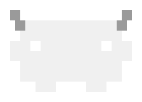

<div align="center">
  <picture>
    <source media="(prefers-color-scheme: dark)" srcset="assets/opencode-delta-mascot-dark.svg">
    <source media="(prefers-color-scheme: light)" srcset="assets/opencode-delta-mascot-light.svg">
    
  </picture>

  <h1>opencode-delta</h1>

  <p>A personal OpenCode fork with QoL improvements, custom agents and skills, risk-based quality gates, and optional Codex integration.</p>
</div>

## Install

```bash
git clone https://github.com/Cruz1122/opencode.git opencode-delta
cd opencode-delta
./install-opencode-delta.sh
```

With Codex integration:

```bash
./install-opencode-delta.sh --codex
```
