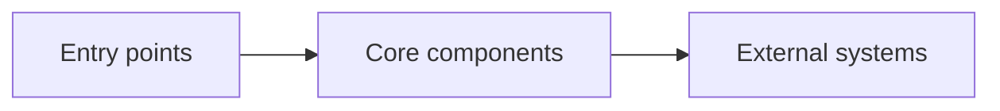

# System map

```mermaid
flowchart LR
    Entry[Entry points] --> Core[Core components]
    Core --> External[External systems]
```

Replace the placeholder only with evidence-backed components and links.
